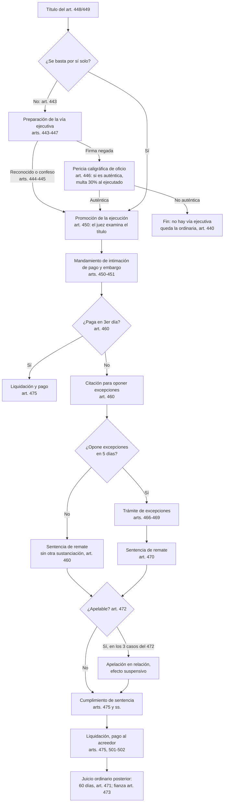

# Juicio ejecutivo (CPC, Ley N° 1337/1988) — flujo, plazos y estrategia

> Articulado verificado contra el texto consolidado local del CPC (2026-07-05, ver
> `shared/authorities/verification-log.md`). Los plazos marcados **[práctica]** provienen de la
> experiencia forense del estudio, no de texto legal: presentarlos siempre como práctica.

## Flujo general

## Etapas en detalle

### 1. Preparación de la vía ejecutiva (arts. 443-447)
- Supuestos (art. 443): a) reconocimiento de documentos privados; b) alquileres: que el demandado
  manifieste si es locatario y exhiba el último recibo (si niega y no se justifica en forma
  indubitada, no hay vía ejecutiva; si luego se prueba en ordinario, multa ≥30%); c) fijación
  judicial de plazo de pago; d) reconocimiento del cumplimiento de la condición; e) contrato
  bilateral: reconocimiento de las obligaciones cumplidas a favor del deudor; f) sueldos no
  laborales.
- Citación bajo apercibimiento de tenerlo por confeso (art. 444). Herederos: pueden limitarse a
  declarar que ignoran la firma (inc. a) o que desconocen los hechos (inc. b).
- Reconocida la firma queda preparada la acción **aunque se niegue el contenido** (art. 445).
- Firma negada → pericia de uno o tres peritos designados de oficio según el monto (art. 446);
  si es auténtica, multa del 30% a favor de la otra parte.
- Plazo de comparecencia: el CPC no lo fija; lo fija el juez (supletorio art. 146: 5 días);
  **[práctica]** suele fijarse en 3 días.
- **Caducidad: 20 días** desde concluidas las medidas para deducir la demanda ejecutiva, sin
  necesidad de notificación (art. 447).

### 2. Intimación de pago y embargo (arts. 450-456)
- El juez examina cuidadosamente el título; si trae aparejada ejecución, libra mandamiento por la
  cantidad líquida, intereses y costas (art. 450).
- El mandamiento se entrega **en el día** al oficial de justicia; incluye facultad de allanar
  domicilio y pedir fuerza pública; el oficial requiere el pago dentro de los 3 días y, si no paga
  en el acto, embarga bienes suficientes sin excederse (art. 451). El embargo vale aun sin
  presencia del deudor, notificándole dentro de 3er día (art. 451 in fine).
- Bienes: normas de inembargabilidad de medidas cautelares (453); el acreedor no puede elegir
  bienes con perjuicio grave habiendo otros (454); depositario (455); inmuebles/registrables: basta
  anotación en el Registro, oficios dentro de 2º día (456).
- Costas a cargo del deudor aunque pague en el acto de la intimación (457).

### 3. Citación y excepciones (arts. 460-469)
- **Pago en 3er día** de la intimación (capital + intereses + gastos fijados) → liquidación sin
  otro trámite (460 → 475).
- Citación para oponer excepciones: por el notificador, con copia de cédula, escrito inicial y
  documentos (460). La intimación importa también requerimiento de **constituir domicilio** bajo
  apercibimiento de tenerlo en secretaría (460, remisión art. 48).
- **Excepciones: 5 días, un solo escrito, con ofrecimiento de prueba** (460). Sin excepciones →
  sentencia de remate sin más sustanciación.
- Lista taxativa (462) + nulidad (463). La **falsedad** solo por falsedad material o adulteración;
  la **inhabilidad** por falta de acción o documento no ejecutivo — **ambas comparten el inc. d del
  462** (el inc. c es litispendencia; el pago es el inc. f). El pago debe ser **documentado**
  (total o parcial). No se investiga la causa (465).
- Trámite (466): excepción no autorizada o imprecisa → desestimación sin sustanciación + sentencia
  de remate. Si procede → **traslado al ejecutante por 5 días** (contesta y ofrece prueba); no hay
  declaración previa de admisibilidad.
- Puro derecho / sin prueba (467): sentencia en **10 días** de contestado el traslado o vencido el
  plazo.
- Con prueba (468): plazo común **≤15 días**; carga de la prueba sobre el **ejecutado**; máx.
  **7 testigos** por parte; sin plazo extraordinario.
- Producidas las pruebas: expediente en secretaría **2 días**; sentencia en **10 días** (469).

### 4. Sentencia de remate y recursos (arts. 470-474)
- Contenido posible (470): nulidad del procedimiento / rechazo de la ejecución / llevarla adelante
  en todo o en parte. *(Epígrafe "Juicio posterior" en la copia local: error de epígrafe, contenido
  verificado.)*
- Apelable solo (472): a) caso del art. 466 párrafo 1º; b) excepciones opuestas e intentadas
  probar; c) excepciones tramitadas como de puro derecho. En relación y con efecto suspensivo.
- Fianza a las resultas del ordinario posterior, a pedido del ejecutado que opuso excepciones
  (473, art. 1457 CC).
- Costas: al vencido, con la regla del pago parcial (474).

### 5. Cumplimiento de la sentencia (arts. 475 y ss.)
| Bien embargado | Vía | Base |
|---|---|---|
| Dinero | Liquidación (capital, intereses, costas) → traslado → aprobación → pago inmediato | 475 |
| Muebles / semovientes | Remate sin base y al contado por martillero; avisos 3 días con 5 de anticipación | 476-479 |
| Inmuebles | Subasta con los recaudos del art. 480 y ss. (texto consolidado verificado) | 480 y ss. |
- Si el ejecutante no liquida en **5 días**, puede liquidar el ejecutado (501). Fianza para
  percibir si el ejecutado la pide; queda cancelada si no promueve el ordinario en **30 días** (501).
- Preferencia: las sumas depositadas no se aplican a otro destino mientras el ejecutante no esté
  pagado, salvo costas de la ejecución o acreedor preferente/privilegiado (502).

### 6. Ampliaciones (arts. 458-459)
- Antes de la sentencia: nuevos plazos/cuotas vencidos amplían la ejecución sin retrotraer (458).
- Después de la sentencia: intimación a exhibir recibos en 5 días bajo apercibimiento de extender
  los efectos de la sentencia (459). Ambas rigen también para alquileres y expensas.

## Ejecuciones especiales

- **Hipotecaria (503-507):** excepciones solo las de los incs. a), b), c), d), e) e i) del 462,
  más pago total o parcial, quita, espera, remisión y transacción **probadas por instrumentos
  públicos/privados o actuaciones judiciales presentados al oponerlas** (504) — si no, se desecha
  el escrito y se dicta sentencia de remate. Informe registral sobre gravámenes y transferencias
  (505); tercero poseedor: intimación a pagar o abandonar en 5 días (506); **prelación**: primero
  el bien hipotecado, embargo limitado a él (507).
- **Prendaria (508-510):** remite a las excepciones del 504 y a la nulidad del 463.
- **Obligación de dar cosa cierta mueble (511-518):** secuestro, allanamiento, pericia sobre
  identidad de la cosa, sentencia con entrega o condena al precio.
- **Ejecución de resoluciones judiciales (519 y ss.):** sentencias firmes, transacciones o acuerdos
  homologados, multas procesales y honorarios regulados en costas (520). Excepciones propias
  (526). Régimen distinto del juicio ejecutivo: no mezclar citas.

## Estrategia por posición

**Ejecutante (cobro):**
- Verificar el título antes de demandar (Paso 1 del SKILL.md); título débil → considerar la opción
  ordinaria (440) antes que arriesgar inhabilidad (462.d) con costas.
- Pedir embargo sobre dinero/registrables primero (facilita el cumplimiento: 475/456).
- Vigilar la caducidad de 20 días tras la preparación (447) y los nuevos vencimientos (458-459).
- Contestar el traslado de excepciones con prueba documental fuerte; la carga probatoria pesa
  sobre el ejecutado (468).

**Ejecutado (defensa):**
- Revisar primero **nulidad** (463): ¿hubo intimación de pago válida y citación correcta? Son
  irrenunciables (461). La nulidad exige depositar la suma del mandamiento u oponer excepciones
  junto al planteo (463.a).
- Encajar la defensa en la lista del 462 — una defensa real mal etiquetada se desestima sin
  sustanciación (466). El pago debe estar **documentado**.
- Evaluar costo-beneficio: pagar en 3er día limita el juicio a la liquidación (460); el pago
  parcial reconocido reparte costas (474).
- Lo no oponible en la ejecución (causa de la obligación, art. 465) se reserva para el **juicio
  ordinario posterior** (471, 60 días), pidiendo fianza si se opusieron excepciones (473).

> **Jurisprudencia:** tres criterios de los Tribunales de Apelación Civil y Comercial están
> verificados como tendencia en `shared/authorities/jurisprudencia.yaml` → `criteria`
> (2024-2025, varias salas): `nulidad_ejecucion_trascendencia` (la nulidad del art. 463 exige
> perjuicio cierto e indicar las defensas impedidas — no hay nulidad por la nulidad misma),
> `inhabilidad_titulo_alcance` (inhabilidad incompatible con oponer pago: reconoce la deuda) y
> `pago_documentado_requisitos` (el recibo debe emanar del acreedor y referir concreta y
> precisamente a los documentos base). Pueden afirmarse como **práctica jurisprudencial**, sin
> citar fallo puntual (carátulas pendientes de PJ/CSJ → para citar un A. y S. concreto,
> `[INSERTAR JURISPRUDENCIA VERIFICADA]`). Otros criterios (p. ej. intimación de pago en el
> domicilio real) siguen **sin verificar** → mismo marcador.
